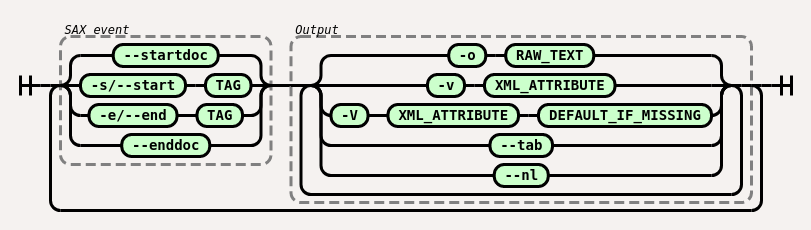

# anglosaxon - Convert large XML files to other formats

`anglosaxon` is a command line tool to parse XML files using SAX. You can do
simple transformations of XML files into other textual formats in a streaming
format. Since it uses SAX it doesn't load the entire XML file into memory
before processing, so it can work with large XML files, like some of the
OpenStreetMap data dump files.

# Example Usage

	bzcat ~/osm/data/changeset-examples.osm.bz2  | anglosaxon -S -o changeset_id,tag_key,tag_value --nl -s tag -v ../id -o,  -v k -o , -v v --nl

This converts the OSM changeset dump file to a CSV of `changeset_id`,
`changeset_tag_key`, `changeset_tag_value`, allowing you to use standard unix
tools to analyze OSM changesets. As of January 2022, the changesets file is 4
GB bzip2 compress (40+ GB uncompressed XML), and is too large for DOM based
tools.

# Installation

	cargo install anglosaxon

# Documention

``anglosaxon`` reads an xml file from stdin and writes to stdout.

Output is controlled by the CLI flags. Specify a SAX event with `-S`/`-s`/`-e`/`-E`, and then one or more output actions to take for that event. Unlike most CLI programmes, the order of flags is relevant.

## SAX events

* `-S`/`--startdoc`: Happes once at the start of the XML document
* `-s TAG`/`--start TAG`: happens when `TAG` is opened, i.e. at the start of the tag. The XML attributes on this tag are available
* `-e TAG`/`--end TAG`: happens when `TAG` is closed, i.e. at the end of the tag
* `-E`/`--end`: Happes once at the end of the XML document

XML Tag names are simple strings.

## Actions to take

One or more actions can be specified and are processed in the order you give.

* `-o TEXT`: Print `TEXT` as is
* `--nl`: Print a newline
* `--tab`: Print a tab
* `-v ATTRIBUTE`: Print the value of this XML attribute. An error happens if the tag doesn't have that attribute
* `-V ATTRIBUTE DEFAULT`: Print the value of this XML attribute, and `DEFAULT` if that attribute doesn't exist.

XML Attributes are plain text. Parent node attributes are specified by `../ATTRIBUTE` (e.g. `../../id` is the `id` attribute of the XML node that's the parent of the parent of the current XML node). An error occurs if this required parent doesn't exist.

# Similar Projects

* [xmlstarlet](https://xmlstar.sourceforge.net/)'s [sel](http://xmlstar.sourceforge.net/doc/UG/ch04.html)/selection functionality was the inspiration. But it's unable to handle large XML
